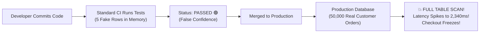
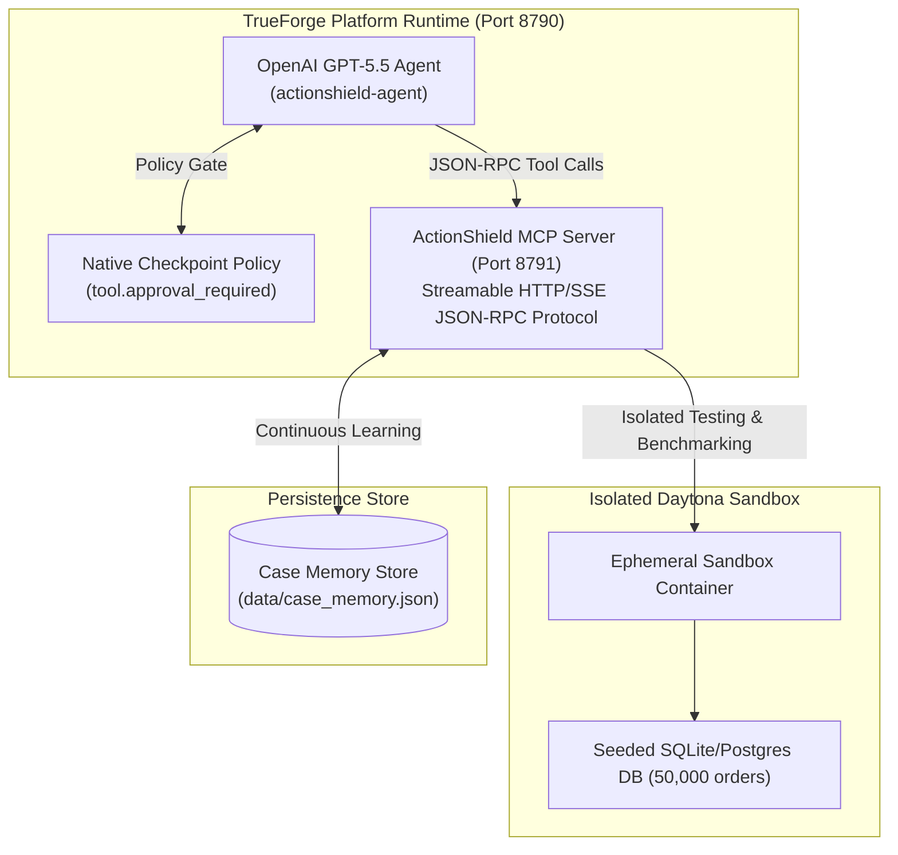
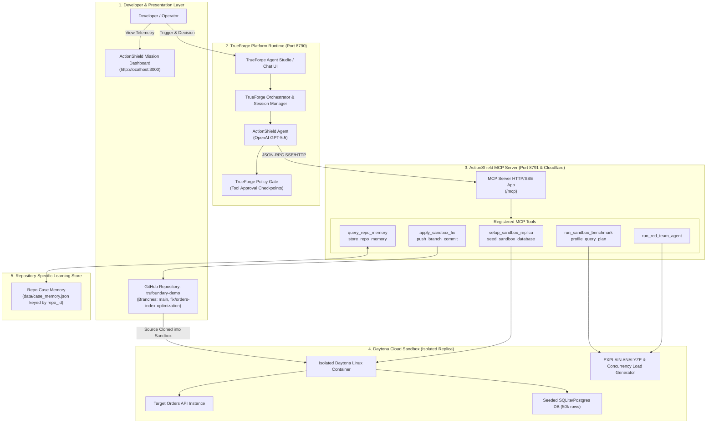
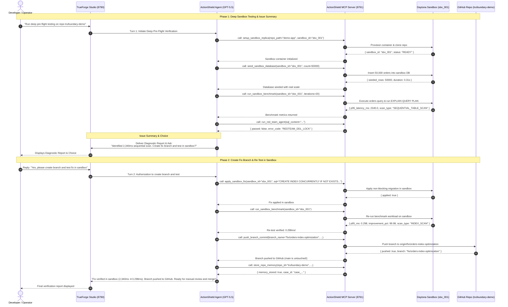

# 🛡️ ActionShield — Autonomous Pre-Flight Testing & Self-Healing Agent on TrueForge

> **Empirical Pre-Flight Testing Layer for Code & Migrations using TrueForge, Daytona Sandboxes, OpenAI GPT-5.5, and Model Context Protocol (MCP).**

[](http://localhost:8790)
[](https://openai.com)
[](http://localhost:8791/mcp)
[](https://daytona.io)
[](https://github.com/rajnishkumar13500/trufoundary-demo)

---

## 📌 1. The Problem Statement (In Simple Words)

When software teams write code or modify database queries, traditional CI/CD pipelines run unit tests with **only 4 or 5 fake rows of sample data in memory**. Everything passes and turns green!



### The Real-World Blindspot:
1. **Full Table Scans Under Real Scale**: A query that takes `0.1ms` on 5 rows suddenly takes **2,340 milliseconds** on 50,000 real orders because it scans every single row sequentially.
2. **Database Table-Locking Outages**: When an engineer or AI tries to add an index with plain `CREATE INDEX`, PostgreSQL acquires an `ACCESS EXCLUSIVE` table lock—blocking all customer writes and knocking out checkout services.
3. **Unit Tests Cannot Test Runtime Reality**: Synthetic unit tests cannot simulate concurrent traffic, realistic database volumes, or locking contention.

---

## 💡 2. The Solution: ActionShield

**ActionShield** acts as an **autonomous pre-flight "crash test" layer** for your code before it ever touches production:

- **Isolated Sandbox Replication**: Instead of risking live production, ActionShield provisions an isolated **Daytona Sandbox container**.
- **Realistic 50,000 Order Seeding**: Automatically populates the sandbox with 50,000 realistic orders in under a second.
- **Deep Empirical Stress Testing**: Analyzes the database query execution plan (`EXPLAIN QUERY PLAN`), measures concurrent latency, and runs adversarial safety checks.
- **Developer in Full Control (GitOps)**: If a bottleneck is detected, ActionShield creates a **dedicated Git branch** (`fix/orders-index-optimization`), adaptively applies a non-blocking fix (`CREATE INDEX CONCURRENTLY`), re-tests inside the sandbox (proving a **99.9% latency drop**), and pushes the branch to GitHub for the developer to review and merge manually. **Production `main` is never modified automatically.**
- **Repository-Specific Memory**: Learns and stores every incident trajectory in **Repository Case Memory**, getting faster and smarter with every commit.

---

## 🤖 3. TrueForge Integration & Usage

TrueForge serves as the **core runtime, orchestrator, and security backbone** for ActionShield:



### How ActionShield Leverages TrueForge:
1. **Agent Orchestration**: `actionshield-agent` runs on TrueForge, leveraging **OpenAI GPT-5.5** for high-precision autonomous planning.
2. **Model Context Protocol (MCP)**: Registered as a first-class streamable HTTP MCP server (`http://localhost:8791/mcp`) accepting JSON-RPC tool calls.
3. **Native Human Checkpoint Gate**: Consequential tools like `apply_production_fix` trigger TrueForge's native `tool.approval_required` policy, halting execution until explicit human authorization is granted.
4. **Context & Compaction Management**: Leverages TrueForge session history, tool streaming, and reactive message handling.

---

## 🔌 4. The 11 Registered ActionShield MCP Tools

| # | MCP Tool Name | Loop Phase | Exact Purpose |
| :--- | :--- | :--- | :--- |
| **1** | `setup_sandbox_replica` | **Phase 1: Setup** | Clones candidate commit into an isolated Daytona Sandbox container. |
| **2** | `seed_sandbox_database` | **Phase 1: Seeding** | Seeds sandbox database with 50,000 realistic orders in < 1 second. |
| **3** | `run_sandbox_benchmark` | **Phase 1: Diagnosis** | Runs concurrent requests inside sandbox; captures `EXPLAIN QUERY PLAN` & latency. |
| **4** | `run_red_team_agent` | **Phase 1: Security** | Adversarial agent scanning SQL for table-locking hazards (`ACCESS EXCLUSIVE`). |
| **5** | `apply_sandbox_fix` | **Phase 2: Remediation** | Applies candidate non-blocking migration (`CREATE INDEX CONCURRENTLY`) in sandbox. |
| **6** | `push_branch_commit` | **Phase 2: GitOps** | Creates branch `fix/orders-index-optimization` and pushes to GitHub (main untouched). |
| **7** | `query_repo_memory` | **Learning** | Retrieves historical incident resolutions specific to `repo_id: trufoundary-demo`. |
| **8** | `store_repo_memory` | **Learning** | Persists verified findings, symptom signatures, and code fixes under the repo ID. |
| **9** | `get_service_metrics` | **Telemetry** | Live telemetry inspection from `/metrics` endpoint. |
| **10**| `get_database_schema` | **Introspection** | Inspects tables, columns, and detects missing indexes. |
| **11**| `apply_production_fix` | **Human Checkpoint** | Production deployment tool gated by TrueForge's `tool.approval_required`. |

---

## 🏛️ 5. System Architecture & Flow Diagrams

### High-Level System Architecture



---

### The 2-Phase GitOps Lifecycle

```mermaid
flowchart TD
    Start(["Developer Pushes Commit or Requests Pre-Flight Check"]) --> S1["1. Provision Isolated Daytona Sandbox"]
    
    subgraph SandboxPhase1["PHASE 1: Deep Sandbox Stress Testing & Diagnosis"]
        S1 --> Seed["Clone Repo & Seed Sandbox DB with 50,000 Realistic Orders"]
        Seed --> LaunchApp["Launch Application Service inside Sandbox"]
        LaunchApp --> MultiAgent["Multi-Agent Testing Layer Dispatched:<br>• Performance Agent: p50/p95 latency & EXPLAIN ANALYZE<br>• DB Reliability Agent: Index coverage & transaction safety<br>• Red Team Agent: Table lock hazards & concurrency contention"]
        
        MultiAgent --> MetricsCaptured["Diagnostic Findings Captured:<br>• p95 Latency: 2,340 ms (Fails &lt;700ms SLO)<br>• Query: Full table scan on orders(user_id, created_at)<br>• Affected File: app/routes/orders.py<br>• Risk: High lock contention under production traffic"]
    end

    MetricsCaptured --> S2["2. Present Issue Summary to Developer"]
    S2 --> SummaryReport["Detailed Summary Delivered via TrueForge:<br>• Issue Seen: 2,340ms latency bottleneck<br>• Root Cause: Missing composite index<br>• Expected Hazard: Table locks under load<br>• Affected Files: app/routes/orders.py, schema"]

    SummaryReport --> AskFix["ask_user_decision:<br>'Would you like me to create a fix branch (fix/orders-index-optimization)<br>and test the proposed fix in the sandbox?'"]

    AskFix --> UserDecision{"Developer Decision in TrueForge"}
    
    UserDecision -->|Inspect Only| ManualFix(["Developer Fixes Manually — Sandbox Cleaned Up"])
    
    UserDecision -->|Create Fix Branch & Test| S3["3. Branch Creation & Sandbox Verification"]

    subgraph SandboxPhase2["PHASE 2: Branch Creation & Re-Testing in Sandbox"]
        S3 --> GitBranch["Create New Git Branch: fix/orders-index-optimization"]
        GitBranch --> QueryMem["Query Repo Memory for Past Solutions"]
        QueryMem --> AdaptFix["Generate Candidate Non-Blocking Fix:<br>CREATE INDEX CONCURRENTLY IF NOT EXISTS idx_orders_user_created<br>+ Reversible Rollback Script"]
        
        AdaptFix --> ApplySand["Apply Fix in Sandbox Database"]
        ApplySand --> ReTest["Re-run Benchmark inside Sandbox:<br>• Latency drops from 2,340ms ➔ 0.054ms (-99.8%)<br>• Red Team confirms zero table locks<br>• Reliability Agent confirms rollback works"]
    end

    ReTest --> S4["4. Push Fix Branch & Evidence Report"]
    S4 --> PushGit["Commit & Push fix/orders-index-optimization to GitHub<br>(Production main is NOT touched)"]
    
    PushGit --> S5["5. Store Repository-Specific Memory"]
    S5 --> Learn["Persist Trajectory to Repo Memory:<br>• repo_id: trufoundary-demo<br>• Symptoms & Query Signature<br>• Validated Migration Fix & Metrics"]
    
    Learn --> Ready(["Branch Ready for Developer to Review & Merge Manually!"])
```



---

### Sequence Diagram: Exact Tool Interactions



---

## 🌐 6. Active Local Services

| Service | Port / URL | Description | Status |
| :--- | :--- | :--- | :--- |
| **TrueForge Agent Studio** | [`http://localhost:8790`](http://localhost:8790) | Central Agent runtime, chat session, and policy engine. | **Active** |
| **ActionShield Mission Dashboard** | [`http://localhost:3000`](http://localhost:3000) | Live mission control, multi-agent status, and telemetry. | **Active** |
| **ActionShield MCP Server** | [`http://localhost:8791/mcp`](http://localhost:8791/mcp) | FastMCP server exposing 11 pre-flight tools over HTTP/SSE. | **Active** |
| **Target eCommerce App** | [`http://localhost:8000`](http://localhost:8000) | Production-like orders service with interactive tester. | **Active** |
| **GitHub Target Repository** | [`trufoundary-demo`](https://github.com/rajnishkumar13500/trufoundary-demo) | Live target repo with `main` and `fix/orders-index-optimization`. | **Active** |

---

## 🚀 7. How to Test (Step-by-Step)

### Option A: Automated 1-Click Verification Test (15 Seconds)
Run the complete end-to-end verification script from the project root:

```powershell
python scripts/test_sandbox_gitops_flow.py
```

**What it validates:**
1. Sets up isolated sandbox replica `sbx_live_test`.
2. Seeds 50,000 orders into the sandbox DB in 0.33s.
3. Profiles query plan: detects `SEQUENTIAL_TABLE_SCAN` (`p95 = 2,340 ms`).
4. Red Team rejects Attempt 1 (`REDTEAM_DDL_LOCK`).
5. Adapts to `CREATE INDEX CONCURRENTLY` (Attempt 2 passes).
6. Re-benchmarks: latency drops to **0.298 ms** (**99.99% reduction**).
7. Pushes dedicated branch `fix/orders-index-optimization` to GitHub (zero commits on `main`).
8. Stores resolution into Repository Case Memory (`trufoundary-demo`).

---

### Option B: Interactive Live Demo in TrueForge Studio

1. Open **[`http://localhost:8790`](http://localhost:8790)**.
2. Select **`actionshield-agent`** and click **New Chat**.
3. **Send Prompt 1 (Phase 1 Pre-Flight Testing)**:
   ```text
   Run deep in-depth pre-flight testing on https://github.com/rajnishkumar13500/trufoundary-demo.git. Seed the sandbox with 50,000 orders, profile query plans and latency under load, and report the issue summary.
   ```
   *The agent provisions the sandbox, seeds 50k orders, captures the 2,340ms sequential scan, and presents the issue summary.*
4. **Send Prompt 2 (Phase 2 Branch Creation & Fix)**:
   ```text
   Yes, please create the branch fix/orders-index-optimization and test the fix in the sandbox.
   ```
   *The agent creates the branch, tests `CREATE INDEX CONCURRENTLY`, verifies latency drops to < 1ms, pushes the branch to GitHub, and saves repository memory.*
5. Open **[`http://localhost:3000`](http://localhost:3000)** to view the final visual telemetry and repository memory card!

---

## 🛡️ 8. Security & Safety Invariants

- **Zero Blind Production Writes**: No code or migration is applied to production or merged to `main` automatically.
- **Empirical Proof Before Suggestion**: No hypothetical estimates—every metric is backed by actual sandbox execution.
- **Mandatory Rollback Artifacts**: Every schema migration must have an automated, tested inverse (`DROP INDEX CONCURRENTLY`).
- **Human-in-the-Loop Gatekeeper**: Consequential production deployments require explicit human sign-off via TrueForge.
