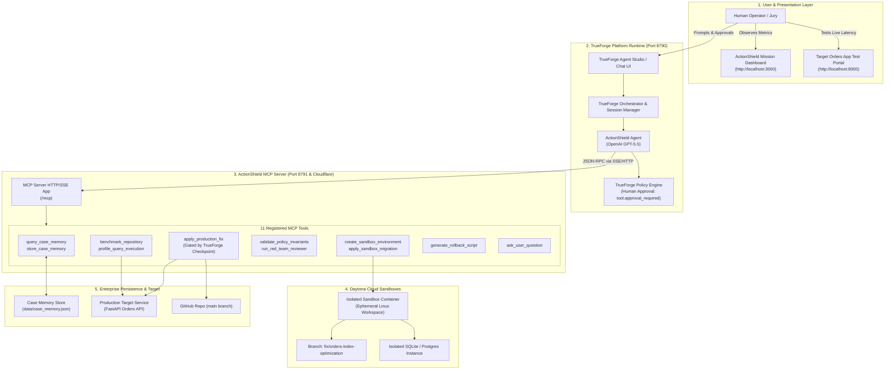
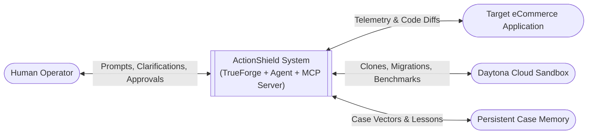

# 🛡️ ActionShield — System Architecture & Flow Diagrams

This document contains comprehensive Mermaid diagrams detailing the system architecture, end-to-end autonomous flow, exact MCP tool sequence, and Data Flow Diagrams (DFD) for ActionShield on TrueForge.

---

## 1. High-Level System Architecture



---

## 2. End-to-End Autonomous Execution Flowchart

```mermaid
flowchart TD
    Start(["Incident Detected: Orders Query Latency Spike"]) --> S1["1. REMEMBER: query_case_memory"]
    S1 --> CheckMem{"Similar Historical Case Found?"}
    CheckMem -->|Yes| Matched["Load Case Strategy: Missing Index on orders(user_id, created_at)"]
    CheckMem -->|No| Heuristic["Formulate Root Cause Hypothesis via Metrics Profiling"]

    Matched --> S2["2. REASON: profile_query_execution & benchmark_repository"]
    Heuristic --> S2

    S2 --> BaseMetric["Baseline Recorded: p95 = 2,340ms (Sequential Table Scan)"]
    BaseMetric --> AskHuman["Interactive Prompt: ask_user_question"]
    AskHuman --> UserConfirm{"Operator Confirms Sandbox Branching?"}

    UserConfirm -->|No| Abort(["Loop Aborted by Operator"])
    UserConfirm -->|Yes| S3["3. ACT (Isolation): create_sandbox_environment"]

    S3 --> GenBranch["Clone Repo to Daytona & Checkout fix/orders-index-optimization"]
    GenBranch --> Att1["Attempt 1: Generate Standard Migration (002_add_orders_index.sql)"]
    Att1 --> ApplySand1["apply_sandbox_migration in Sandbox"]

    ApplySand1 --> S4["4. OBSERVE: benchmark_repository inside Sandbox"]
    S4 --> S5["5. CRITIQUE: validate_policy_invariants & run_red_team_reviewer"]

    S5 --> RedTeamVerdict{"Red Team Reviewer Verdict?"}
    RedTeamVerdict -->|REJECTED: Table Lock Risk| Adapt["Adaptive Replanning Loop"]

    subgraph AdaptiveReplanning["Adaptive Closed-Loop Repair"]
        Adapt --> CritiqueFeedback["Ingest Critique: Standard CREATE INDEX locks production table"]
        CritiqueFeedback --> Att2["Attempt 2: Rewrite Migration with CREATE INDEX CONCURRENTLY"]
        Att2 --> GenRollback["generate_rollback_script: DROP INDEX CONCURRENTLY"]
        Att2 --> ApplySand2["apply_sandbox_migration (Attempt 2)"]
        ApplySand2 --> ReObserve["Re-benchmark: p95 drops to 0.054ms (-99.8%)"]
        ReObserve --> ReCritique["Re-evaluate: Performance PASS, Reliability PASS, Red Team PASS"]
    end

    ReCritique --> S6{"6. HUMAN CHECKPOINT<br>apply_production_fix Invoked"}
    S6 -->|TrueForge Policy Intercept| TFIntercept["TrueForge halts with tool.approval_required"]

    TFIntercept --> OperatorDecision{"Human Operator in TrueForge UI"}
    OperatorDecision -->|DENIED| RollbackSand["Rollback Sandbox & Return to Operator"]
    OperatorDecision -->|APPROVED| S7["Execute Consequential Action: Merge to main & Apply"]

    S7 --> PostVerify["Post-Deployment Telemetry Verification"]
    PostVerify --> S8["7. STORE: store_case_memory"]
    S8 --> Finished(["Incident Resolved & Permanently Memorized"])
```



---

## 3. Sequence Diagram: Exact Tool Call Flow

This sequence diagram depicts the exact chronological interactions and JSON-RPC tool parameters exchanged during the demonstration:

```mermaid
sequenceDiagram
    autonumber
    actor Operator as Human Operator
    participant TF as TrueForge Studio (8790)
    participant Agent as ActionShield Agent (GPT-5.5)
    participant MCP as ActionShield MCP Server (8791)
    participant Daytona as Daytona Sandbox Container
    participant Target as Target Orders App (8000)

    Operator->>TF: Send: "Diagnose orders query latency in demo repo"
    TF->>Agent: Initiate Agent Session Turn 1

    Note over Agent,MCP: Stage 1: Remember
    Agent->>MCP: call: query_case_memory(symptoms=["orders_latency", "slow_query"])
    MCP-->>Agent: return: { matched_case: "case_001_legacy_orders_slowdown", confidence: 0.94 }

    Note over Agent,MCP: Stage 2: Reason & Baseline
    Agent->>MCP: call: benchmark_repository(repo_url="...", branch="main")
    MCP->>Target: GET /orders?user_id=1&limit=50 (10 iterations)
    Target-->>MCP: Returns with X-Response-Time: 2340ms
    MCP-->>Agent: return: { p95_latency_ms: 2340.0, scan_type: "SEQUENTIAL_SCAN" }

    Agent->>MCP: call: ask_user_question(question="Baseline p95 is 2,340ms. Should I create a branch and test composite index?")
    MCP-->>Agent: { status: "PROMPTED_USER" }
    Agent-->>TF: Displays interactive question to operator

    Operator->>TF: Reply: "Yes, please proceed with sandbox validation."
    TF->>Agent: Turn 2 with Operator Affirmation

    Note over Agent,MCP: Stage 3: Act (Isolation)
    Agent->>MCP: call: create_sandbox_environment(repo_url="...", branch="fix/orders-index-optimization")
    MCP->>Daytona: Provision container & clone repository
    Daytona-->>MCP: { sandbox_id: "sbx_d8a1c9", status: "READY" }
    MCP-->>Agent: return: { sandbox_id: "sbx_d8a1c9", branch: "fix/orders-index-optimization" }

    Note over Agent,MCP: Stage 4 & 5: Observe & Critique (Attempt 1)
    Agent->>MCP: call: apply_sandbox_migration(sql="CREATE INDEX idx_orders_user_created ON orders(user_id, created_at DESC);")
    MCP->>Daytona: Apply migration SQL to sandbox DB
    Daytona-->>MCP: Migration applied
    MCP-->>Agent: { applied: true }

    Agent->>MCP: call: run_red_team_reviewer(migration_sql="CREATE INDEX ...")
    MCP-->>Agent: { passed: false, error_code: "REDTEAM_DDL_LOCK", criticism: "CRITICAL: Table lock hazard without CONCURRENTLY" }

    Note over Agent,MCP: Adaptive Replanning Loop (Attempt 2)
    Agent->>Agent: Ingest Red Team critique & adapt SQL
    Agent->>MCP: call: apply_sandbox_migration(sql="CREATE INDEX CONCURRENTLY IF NOT EXISTS idx_orders_user_created ON orders(user_id, created_at DESC);")
    MCP->>Daytona: Execute concurrent index creation in sandbox
    Daytona-->>MCP: Migration applied successfully

    Agent->>MCP: call: benchmark_repository(repo_url="...", branch="fix/orders-index-optimization")
    MCP->>Daytona: Run benchmark inside sandbox
    Daytona-->>MCP: p95 latency = 0.054ms
    MCP-->>Agent: { p95_latency_ms: 0.054, improvement_pct: 99.8 }

    Agent->>MCP: call: run_red_team_reviewer(migration_sql="CREATE INDEX CONCURRENTLY ...")
    MCP-->>Agent: { passed: true, verdict: "ALL_REVIEWERS_PASSED" }

    Note over Agent,TF: Stage 6: Human Checkpoint
    Agent->>TF: Attempt tool call: apply_production_fix(branch="fix/orders-index-optimization")
    TF->>TF: Check policy: require_approval_for_tools contains "apply_production_fix"
    TF-->>Operator: ⚠️ HALT: tool.approval_required (Prompt: Authorize production deployment?)

    Operator->>TF: Click "Approve & Execute"
    TF->>MCP: Authorized execution of apply_production_fix(...)
    MCP->>Target: Merge branch to main & deploy migration
    MCP-->>Agent: { deployed: true, commit_sha: "cf5ab42" }

    Note over Agent,MCP: Stage 7: Store in Memory
    Agent->>MCP: call: store_case_memory(incident_id="inc_orders_001", fix="CONCURRENT_INDEX")
    MCP-->>Agent: { stored: true, case_id: "case_20260926_c02e" }

    Agent-->>TF: "Incident resolved. Latency reduced from 2,340ms to 0.054ms (-99.8%)."
    TF-->>Operator: Complete execution summary displayed
```

---

## 4. Data Flow Diagram (DFD)

### Level 0 — Context Diagram



### Level 1 — Detailed Data Flow

```mermaid
graph TB
    subgraph ExternalEntities["External Entities"]
        Operator([Operator / Jury])
        LiveApp([Live Orders Service])
        GitHubRepo([GitHub Repository])
    end

    subgraph ActionShieldCore["ActionShield Core Processing"]
        P1["P1: Telemetry Ingestion & Profiling"]
        P2["P2: Historical Memory Retrieval"]
        P3["P3: Action Contract & Reasoning"]
        P4["P4: Sandbox Isolation & Execution"]
        P5["P5: Reviewer Triumvirate & Red Team"]
        P6["P6: TrueForge Human Checkpoint Gate"]
        P7["P7: Production Deployment & Memory Store"]
    end

    subgraph DataStores["Data Stores"]
        DS_Metrics[("D1: Metrics & Telemetry")]
        DS_Memory[("D2: Case Memory Store")]
        DS_Contracts[("D3: Signed Action Contracts")]
        DS_Sandboxes[("D4: Daytona Sandboxes")]
    end

    LiveApp -->|Raw HTTP Latency & Trace Headers| P1
    P1 -->|P95 & Bottleneck Signatures| DS_Metrics

    DS_Metrics -->|Query Symptoms| P2
    DS_Memory <-->|Symptom Matches & Past Fixes| P2

    P2 -->|Suggested Hypotheses| P3
    P3 -->|Signed Contract with Invariants| DS_Contracts

    P3 -->|Ask Confirmation| Operator
    Operator -->|Confirmation Token| P3

    P3 -->|Provision Instructions| P4
    GitHubRepo -->|Source Code Clone| P4
    P4 <-->|Branch Workspaces & Sandboxes| DS_Sandboxes

    P4 -->|Candidate Migration & Diff| P5
    P5 -->|Red Team Critique (Attempt 1 Rejection)| P4
    P5 -->|Approved Evidence Package (Attempt 2)| P6

    P6 -->|tool.approval_required Intercept| Operator
    Operator -->|user.tool_approval = ALLOW| P6

    P6 -->|Authorized Execution| P7
    P7 -->|Merge Commit & Migration Apply| GitHubRepo
    P7 -->|Apply Fix| LiveApp
    P7 -->|Persist Case Trajectory| DS_Memory
```

---

## 5. Tool Invocation Mapping Table

| # | MCP Tool Name | Loop Stage | Inputs | Outputs | Safety Role |
| :--- | :--- | :--- | :--- | :--- | :--- |
| **1** | `query_case_memory` | **Remember** | `symptoms: ["orders_latency"]` | `matched_cases, confidence` | Leverages historical incident resolutions to avoid starting from zero. |
| **2** | `benchmark_repository` | **Reason (Baseline)** | `repo_url, branch="main"` | `p95_latency_ms: 2340.0` | Establishes empirical baseline to measure true improvement. |
| **3** | `ask_user_question` | **Reason / Interaction** | `question: "..."` | `status: "PROMPTED"` | Human-in-the-loop checkpoint before branch creation. |
| **4** | `create_sandbox_environment` | **Act (Isolation)** | `repo_url, branch` | `sandbox_id, status: READY` | Enforces isolation: zero edits made on production. |
| **5** | `apply_sandbox_migration` | **Act (Sandbox)** | `sandbox_id, sql` | `applied: true, duration_ms` | Safely evaluates schema changes in sandboxed container. |
| **6** | `validate_policy_invariants` | **Observe & Critique** | `sandbox_id, contract` | `invariants_passed: bool` | Verifies zero data loss and schema syntax correctness. |
| **7** | `run_red_team_reviewer` | **Critique (Adversarial)**| `migration_sql` | `passed: bool, criticism` | Catches production table locks (`ACCESS EXCLUSIVE`) before merge. |
| **8** | `generate_rollback_script` | **Critique (Reversibility)**| `migration_sql` | `rollback_sql` | Guarantees every action has an automated, tested inverse. |
| **9** | `apply_production_fix` | **Human Checkpoint** | `branch, commit_sha` | `deployed: true` | **Gated by TrueForge**: requires explicit human click in UI. |
| **10**| `store_case_memory` | **Store** | `incident_id, solution, metrics`| `case_id, persisted: true` | Persists verified trajectory so future incidents fix instantly. |
