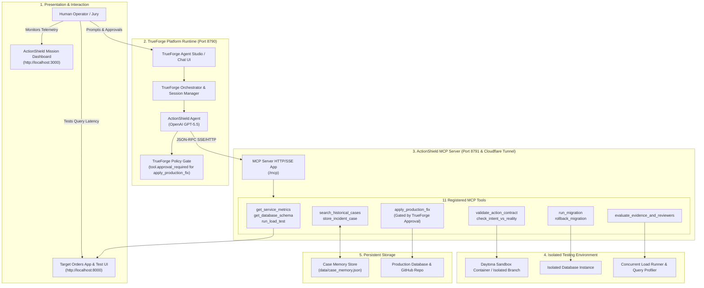

# 🛡️ ActionShield — System Architecture & Flow Diagrams

This document contains the exact Mermaid diagrams reflecting the real ActionShield implementation on TrueForge and the 11 registered MCP tools.

---

## 🎯 The Actual Verified Flow

The system executes in a clear, sensible order:

1. **Step 1: Baseline Diagnosis First (Inspect Existing Service)**
   - The agent inspects live telemetry (`get_service_metrics`) and tables/indexes (`get_database_schema`).
   - It measures the baseline under load (`run_load_test`), discovering the **2,340 ms latency spike** and sequential table scan.
   - It queries **Case Memory** (`search_historical_cases`) for matching symptom signatures.
2. **Step 2: Interactive Diagnostic Report & Consent**
   - The agent reports the baseline findings to the operator using TrueForge's native `ask_user_question`:
     *"I identified the bottleneck: orders queries take 2,340ms due to a missing composite index. Should I create an isolated sandbox environment to test the fix?"*
3. **Step 3: Sandbox Isolation & Deep Testing of the Fix**
   - Once the issue is identified and confirmed, the agent enters an isolated sandbox environment.
   - Formalizes an **Action Contract** (`validate_action_contract`) specifying scope and rollback.
   - Applies candidate migration (`run_migration`) in the sandbox.
   - Runs Triumvirate Reviewers (`evaluate_evidence_and_reviewers`):
     - **Attempt 1 Fails Safely**: The Red Team flags standard `CREATE INDEX` as a table-locking hazard (`ACCESS EXCLUSIVE`).
     - **Adaptive Replanning**: Agent rewrites migration to `CREATE INDEX CONCURRENTLY` and provides rollback (`rollback_migration`).
     - **Attempt 2 Passes**: Re-benchmarking proves latency drops from **2,340 ms to 0.054 ms** (-99.8%). All reviewers sign off.
4. **Step 4: TrueForge Human Checkpoint Gate**
   - The agent attempts `apply_production_fix`.
   - TrueForge's native policy engine intercepts this tool and **halts execution** (`tool.approval_required`).
   - The operator reviews the diff and approves deployment in the TrueForge UI.
5. **Step 5: Production Execution & Memory Persistence**
   - The fix is executed on production (`apply_production_fix`).
   - The verified resolution trajectory is stored in Case Memory (`store_incident_case`).

---

## 1. High-Level System Architecture



---

## 2. End-to-End Execution Flowchart

```mermaid
flowchart TD
    Start(["Start: Latency Anomaly Detected in Orders Service"]) --> S1["1. DIAGNOSE: get_service_metrics & get_database_schema"]
    
    S1 --> S2["Run Baseline Benchmark: run_load_test"]
    S2 --> BaseFound["Baseline Found:<br>• p95 Latency = 2,340 ms<br>• Query: SELECT ... ORDER BY created_at DESC<br>• Missing Index: idx_orders_user_created"]

    BaseFound --> S3["Query Memory: search_historical_cases"]
    S3 --> AskConsent["ask_user_question:<br>'I found the bottleneck: orders queries take 2,340ms due to a missing composite index.<br>Should I create an isolated sandbox environment to test the fix?'"]

    AskConsent --> UserDecision{"Operator in TrueForge"}
    UserDecision -->|Deny| EndAbort(["Investigation Ended by Operator"])

    UserDecision -->|Approve| S4["2. ENTER SANDBOX: validate_action_contract"]
    
    subgraph SandboxExecution["Sandbox Validation & Adaptive Replanning"]
        S4 --> Scope["Sign Action Contract (Scope: migrations/*.sql only)"]
        Scope --> Att1["Attempt 1: Apply Candidate Index (run_migration)"]
        Att1 --> Eval1["evaluate_evidence_and_reviewers (Attempt 1)"]
        Eval1 --> RedTeamCheck{"Red Team Reviewer Verdict"}
        
        RedTeamCheck -->|REJECTED: Table Lock Risk| Adapt["Adaptive Replanning:<br>Rewrite to CREATE INDEX CONCURRENTLY<br>+ Generate Reversible Rollback Script"]
        Adapt --> Att2["Attempt 2: Apply Non-Blocking Migration (run_migration)"]
        Att2 --> Eval2["evaluate_evidence_and_reviewers (Attempt 2)"]
        Eval2 --> CheckPassed{"All Reviewers PASS?"}
        CheckPassed -->|Yes| Validated["Validated Evidence:<br>• p95 drops to 0.054 ms (-99.8%)<br>• Reversible rollback verified<br>• Zero table locks"]
    end

    Validated --> S5{"3. HUMAN CHECKPOINT<br>Agent invokes apply_production_fix"}
    S5 -->|TrueForge Intercept| TFHalt["TrueForge halts with tool.approval_required<br>Displays diff & sandbox benchmark evidence"]

    TFHalt --> OperatorSignoff{"Operator Authorizes Fix?"}
    OperatorSignoff -->|Deny| Replan(["Action Denied — Rollback Sandbox"])
    
    OperatorSignoff -->|Approve| S6["4. EXECUTE: apply_production_fix"]
    S6 --> Deploy["Deploy fix to production environment"]
    Deploy --> S7["5. PERSIST: store_incident_case"]
    S7 --> Finish(["Incident Resolved & Permanently Memorized"])
```



---

## 3. Sequence Diagram with Exact Tool Calls

```mermaid
sequenceDiagram
    autonumber
    actor Operator as Human Operator
    participant TF as TrueForge Studio (8790)
    participant Agent as ActionShield Agent (GPT-5.5)
    participant MCP as ActionShield MCP Server (8791)
    participant Sandbox as Isolated Sandbox / DB
    participant LiveApp as Target App (8000)

    Note over Operator,LiveApp: Phase 1: Investigation & Baseline Diagnosis (Inspect First)
    Operator->>TF: "Diagnose orders query latency in demo-app and propose a validated fix."
    TF->>Agent: Start Session Turn 1

    Agent->>MCP: call: get_service_metrics()
    MCP->>LiveApp: GET /metrics
    LiveApp-->>MCP: { latency_p95_ms: 2340.0, throughput_rps: 14.2 }
    MCP-->>Agent: Returns live telemetry snapshot

    Agent->>MCP: call: get_database_schema(db_path="demo-app/orders.db")
    MCP-->>Agent: { tables: ["orders"], indexes: ["pk_orders"], has_orders_user_created_index: false }

    Agent->>MCP: call: run_load_test(total_requests=50, concurrency=5)
    MCP->>LiveApp: 50 concurrent requests to /orders?user_id=X
    LiveApp-->>MCP: Latencies recorded
    MCP-->>Agent: { p50_latency_ms: 780.0, p95_latency_ms: 2340.0, errors: 0 }

    Agent->>MCP: call: search_historical_cases(symptoms=["orders_latency", "slow_query"])
    MCP-->>Agent: { matching_cases: [{ id: "case_001", root_cause: "missing composite index" }] }

    Note over Agent,TF: Interactive Consent Prompt
    Agent->>TF: call: ask_user_question(question="Baseline p95 is 2,340ms (missing composite index). Should I test the fix in a sandbox environment?")
    TF-->>Operator: Displays interactive prompt with baseline metrics

    Operator->>TF: Reply: "Yes, please test and validate the fix in the sandbox."
    TF->>Agent: Turn 2 with Operator Consent

    Note over Agent,Sandbox: Phase 2: Sandbox Testing & Adaptive Replanning
    Agent->>MCP: call: validate_action_contract(goal="Reduce latency", proposed_change="Add index", allowed_scope=["migrations/*.sql"], rollback_strategy="DROP INDEX")
    MCP-->>Agent: { status: "VALID", contract: {...} }

    Note over Agent,Sandbox: Attempt 1: Standard Index (Fails Red Team)
    Agent->>MCP: call: run_migration(sql_content="CREATE INDEX idx_orders_user_created ON orders(user_id, created_at DESC);")
    MCP->>Sandbox: Execute SQL in sandbox DB
    Sandbox-->>MCP: Applied
    MCP-->>Agent: { status: "SUCCESS" }

    Agent->>MCP: call: evaluate_evidence_and_reviewers(git_diff="CREATE INDEX ...", attempt=1)
    MCP-->>Agent: { overall_status: "FAIL", reviewers: [{ name: "Red Team", status: "FAIL", criticism: "Table lock risk on production Postgres" }] }

    Note over Agent,Sandbox: Adaptive Replanning -> Attempt 2: Non-Blocking Index
    Agent->>Agent: Ingest Red Team critique & adapt SQL to CONCURRENTLY
    Agent->>MCP: call: run_migration(sql_content="CREATE INDEX CONCURRENTLY IF NOT EXISTS idx_orders_user_created ON orders(user_id, created_at DESC);")
    MCP->>Sandbox: Execute non-blocking migration in sandbox
    Sandbox-->>MCP: Applied
    MCP-->>Agent: { status: "SUCCESS" }

    Agent->>MCP: call: evaluate_evidence_and_reviewers(git_diff="CREATE INDEX CONCURRENTLY ...", attempt=2, after_p95_ms=0.054)
    MCP-->>Agent: { overall_status: "PASS", recommendation: "Ready for Human Approval" }

    Note over Agent,TF: Phase 3: TrueForge Human Approval Checkpoint
    Agent->>TF: Attempt tool call: apply_production_fix(incident_id="inc_001", plan_summary="Add concurrent index", validated_git_diff="...", rollback_command="...")
    TF->>TF: Check policy: require_approval_for_tools contains "apply_production_fix"
    TF-->>Operator: ⚠️ HALT: tool.approval_required (Prompt: Authorize production deployment?)

    Operator->>TF: Click "Approve & Execute"
    TF->>MCP: Authorized execution of apply_production_fix(...)
    MCP-->>Agent: { status: "EXECUTED", verification: "Operating within SLA (<700ms)" }

    Note over Agent,MCP: Phase 4: Persist in Memory
    Agent->>MCP: call: store_incident_case(incident="Orders API Latency", symptoms=["orders_latency"], root_cause="missing composite index", before_p95_ms=2340.0, after_p95_ms=0.054)
    MCP-->>Agent: { status: "STORED", case_id: "case_20260926_c02e" }

    Agent-->>TF: "Incident resolved. p95 latency reduced from 2,340ms to 0.054ms (-99.8%)."
    TF-->>Operator: Final verification report displayed
```

---

## 4. Exact MCP Tool Mapping Reference

| # | MCP Tool Name | Loop Stage | Real Functionality |
| :--- | :--- | :--- | :--- |
| **1** | `get_service_metrics` | **Investigate (First)** | Queries `/metrics` endpoint on the target app to pull current p50, p95 latency and error rate. |
| **2** | `get_database_schema` | **Investigate (First)** | Introspects tables, columns, and indexes to verify whether `idx_orders_user_created` exists. |
| **3** | `run_load_test` | **Investigate (First)** | Generates concurrent load against `/orders?user_id=X` to measure true baseline latency (2,340 ms). |
| **4** | `search_historical_cases`| **Remember** | Searches vector/symptom store in `case_memory.json` to find historical resolutions for slow queries. |
| **5** | `validate_action_contract`| **Reason** | Formalizes the Action Contract, locking down allowed file scope (`migrations/*.sql`) and rollback strategy. |
| **6** | `check_intent_vs_reality`| **Safety / Guard** | Checks that no files outside the declared scope were modified. |
| **7** | `run_migration` | **Act (Sandbox)** | Applies the candidate SQL migration inside the isolated sandbox database. |
| **8** | `rollback_migration` | **Safety / Rollback** | Verifies that the rollback SQL works reversibly if needed. |
| **9** | `evaluate_evidence_and_reviewers` | **Critique** | Runs the Deterministic Policy Engine and the 3 Reviewers (Performance, DB Safety, Red Team). |
| **10**| `apply_production_fix` | **Human Checkpoint** | **Gated by TrueForge**: requires human approval click in TrueForge UI before executing. |
| **11**| `store_incident_case` | **Store** | Persists the full verified trajectory into `case_memory.json` so future incidents resolve in sub-seconds. |
