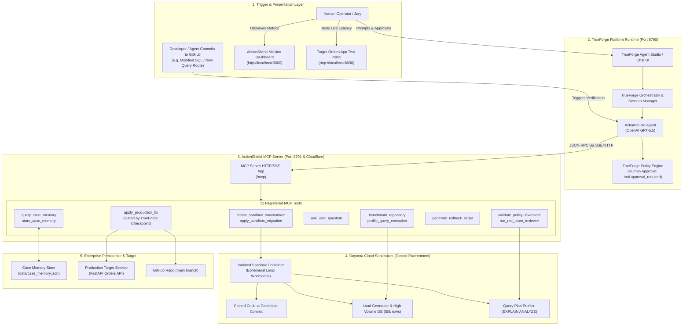
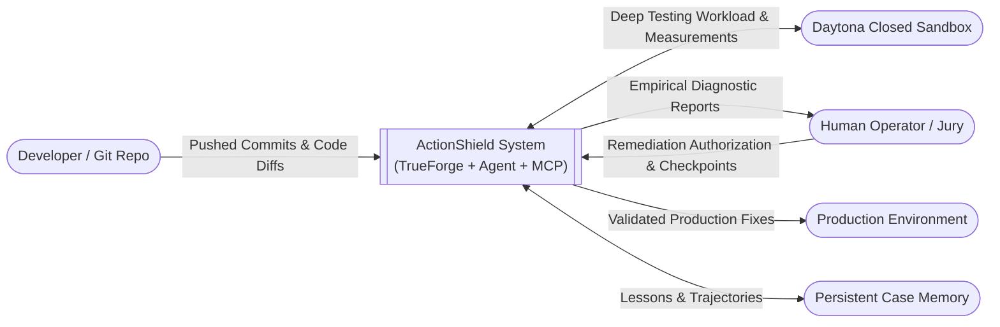

# 🛡️ ActionShield — System Architecture & Flow Diagrams

This document contains comprehensive Mermaid diagrams detailing the updated architecture and flow of ActionShield on TrueForge.

### 💡 Core Mission ("The Moto")
ActionShield is **NOT just an auto-fix bot**. Its primary mission is **Deep Empirical In-Depth Testing of Commits/PRs in Closed Sandbox Environments**:
1. When code or SQL changes are committed to a repository, standard CI only checks unit tests and syntax.
2. Standard CI completely misses **runtime latency regressions, full table scans, connection leaks, and database table-locking hazards (`ACCESS EXCLUSIVE`)**.
3. **Phase 1 (Deep Verification Gate)**: ActionShield pulls the commit into an isolated Daytona Sandbox, runs live high-volume benchmarks, profiles query execution plans, runs Red Team security/safety analysis, and delivers an empirical diagnostic report to the engineer.
4. **Phase 2 (Autonomous Remediation)**: If the engineer requests a fix, ActionShield uses closed-loop adaptive replanning in the sandbox to solve the bottleneck, empirically proves the fix, and requests human authorization via TrueForge before merging.

---

## 1. High-Level System Architecture



---

## 2. End-to-End Autonomous Flow: The 2-Phase Architecture

```mermaid
flowchart TD
    %% Phase 1
    subgraph Phase1["PHASE 1: Deep In-Depth Testing in Closed Sandbox Environment (Pre-Merge Gate)"]
        C1["Developer Commits Changes to GitHub<br>(e.g. New orders filtering query in main or PR)"] --> T1["create_sandbox_environment"]
        T1 --> SB1["Provision Isolated Daytona Sandbox Container"]
        SB1 --> Bench1["benchmark_repository & profile_query_execution<br>Under 50,000 Row Synthetic Load"]
        Bench1 --> AnalyzePlan["Analyze SQL Query Plan: Full Sequential Table Scan Found"]
        AnalyzePlan --> RedTeam1["run_red_team_reviewer: Adversarial Policy Scan"]
        RedTeam1 --> LatencyReport["Empirical Metrics Captured:<br>• p95 Latency: 2,340 ms (Fails &lt;700ms SLO)<br>• Lock Hazard: High contention on unindexed column"]
        LatencyReport --> ReportUser["Report Detailed Diagnostic Findings to User / TrueForge"]
    end

    %% Transition
    ReportUser --> AskFix["ask_user_question:<br>'Deep testing discovered 2,340ms bottleneck & lock hazard.<br>Would you like me to test a self-healing fix in the sandbox?'"]
    AskFix --> UserChoice{"Operator Decision in TrueForge"}

    UserChoice -->|Inspect Only| DoneInspect(["Operator Reviews Report & Fixes Manually"])
    
    %% Phase 2
    subgraph Phase2["PHASE 2: Autonomous Self-Healing & Empirical Validation"]
        UserChoice -->|Approve Fix Testing| Mem["query_case_memory for similar historical patterns"]
        Mem --> GenCandidate["Generate Candidate Fix in Sandbox:<br>Candidate 1: Standard CREATE INDEX"]
        GenCandidate --> RTCheck{"Red Team Reviewer Check"}
        RTCheck -->|REJECTED: DDL Table Lock| AdaptLoop["Adaptive Replanning:<br>Rewrite to CREATE INDEX CONCURRENTLY<br>+ Generate Reversible Rollback Script"]
        AdaptLoop --> ReTest["Re-run Benchmark in Sandbox: Latency drops to 0.054ms (-99.8%)"]
        ReTest --> ReviewersPass["All Reviewers PASS: Performance, Reliability, Red Team"]
    end

    %% Checkpoint
    ReviewersPass --> HumanGate{"TrueForge Checkpoint Gate:<br>apply_production_fix"}
    HumanGate -->|Intercept: tool.approval_required| HaltPrompt["TrueForge UI Halts: Displays Diff & Verification Evidence"]
    HaltPrompt --> OperatorAction{"Operator Action in TrueForge"}

    OperatorAction -->|Deny| Cancel(["Action Cancelled — Sandbox Destroyed"])
    OperatorAction -->|Approve| Deploy["Execute apply_production_fix:<br>Merge branch to main & Apply to Production"]

    Deploy --> VerifyProd["Verify Production Health: p95 &lt; 1ms"]
    VerifyProd --> Store["store_case_memory: Save Trajectory for Future Retrieval"]
    Store --> Complete(["Incident Resolved & Memorized"])
```



---

## 3. Sequence Diagram: Step-by-Step Tool Interactions

```mermaid
sequenceDiagram
    autonumber
    actor Dev as Developer / Operator
    participant TF as TrueForge Studio (8790)
    participant Agent as ActionShield Agent (GPT-5.5)
    participant MCP as ActionShield MCP Server (8791)
    participant Daytona as Daytona Sandbox (Closed Env)
    participant Target as Target Repo / Live App

    Note over Dev,Target: PHASE 1: Deep In-Depth Testing of Committed Code in Sandbox
    Dev->>TF: Push Commit / Send: "Validate commit cf5ab42 on https://github.com/rajnishkumar13500/trufoundary-demo.git"
    TF->>Agent: Start Validation Session Turn 1

    Agent->>MCP: call: create_sandbox_environment(repo_url="...", commit_or_branch="main")
    MCP->>Daytona: Spin up isolated Linux container & clone commit
    Daytona-->>MCP: { sandbox_id: "sbx_d8a1c9", status: "READY" }
    MCP-->>Agent: Sandbox container initialized

    Agent->>MCP: call: benchmark_repository(sandbox_id="sbx_d8a1c9", iterations=10)
    MCP->>Daytona: Execute query workload against 50k rows
    Daytona-->>MCP: { p95_latency_ms: 2340.0, scan_type: "SEQUENTIAL_SCAN" }
    MCP-->>Agent: Benchmark results returned

    Agent->>MCP: call: profile_query_execution(sandbox_id="sbx_d8a1c9", query="orders search")
    MCP->>Daytona: Run EXPLAIN ANALYZE
    Daytona-->>MCP: { plan: "Seq Scan on orders, cost=0.00..1845.00, rows=50000" }
    MCP-->>Agent: Query plan profile returned

    Agent->>MCP: call: run_red_team_reviewer(code_diff="...")
    MCP-->>Agent: { passed: false, warnings: ["Missing composite index", "Table-scan under concurrency"] }

    Note over Agent,TF: Presentation of Findings & Confirmation
    Agent->>MCP: call: ask_user_question(question="Deep testing revealed p95 latency = 2,340ms (Sequential Scan). Would you like me to test a self-healing composite index in the sandbox?")
    MCP-->>Agent: { status: "PROMPTED_USER" }
    Agent-->>TF: Displays diagnostic report & prompt to Operator

    Note over Dev,Target: PHASE 2: Autonomous Self-Healing & Human Approval
    Dev->>TF: Reply: "Yes, please test and validate the fix in the sandbox."
    TF->>Agent: Session Turn 2 with Authorization

    Agent->>MCP: call: query_case_memory(symptoms=["orders_latency", "sequential_scan"])
    MCP-->>Agent: { matched_case: "case_001_legacy_orders_slowdown", confidence: 0.94 }

    Agent->>MCP: call: apply_sandbox_migration(sandbox_id="sbx_d8a1c9", sql="CREATE INDEX CONCURRENTLY IF NOT EXISTS idx_orders_user_created ON orders(user_id, created_at DESC);")
    MCP->>Daytona: Apply non-blocking migration in sandbox
    Daytona-->>MCP: Migration successful

    Agent->>MCP: call: benchmark_repository(sandbox_id="sbx_d8a1c9")
    MCP->>Daytona: Re-run benchmark workload
    Daytona-->>MCP: { p95_latency_ms: 0.054, improvement_pct: 99.8 }
    MCP-->>Agent: Re-test verified: 0.054ms!

    Agent->>MCP: call: generate_rollback_script(migration_sql="CREATE INDEX CONCURRENTLY ...")
    MCP-->>Agent: { rollback_sql: "DROP INDEX CONCURRENTLY IF EXISTS idx_orders_user_created;" }

    Note over Agent,TF: TrueForge Human Checkpoint Gate
    Agent->>TF: Attempt tool call: apply_production_fix(branch="fix/orders-index-optimization")
    TF->>TF: Check policy: require_approval_for_tools contains "apply_production_fix"
    TF-->>Dev: ⚠️ HALT: tool.approval_required (Show diff, benchmark: 2,340ms -> 0.054ms)

    Dev->>TF: Click "Approve & Deploy"
    TF->>MCP: Authorized execution of apply_production_fix
    MCP->>Target: Merge fix to main & apply migration
    MCP-->>Agent: { deployed: true, commit_sha: "1d48ec9" }

    Agent->>MCP: call: store_case_memory(incident_id="inc_orders_001", fix="CONCURRENT_INDEX")
    MCP-->>Agent: { stored: true, case_id: "case_20260926_c02e" }

    Agent-->>TF: "Verification and deployment complete. Latency verified at 0.054ms."
    TF-->>Dev: Final verified resolution summary displayed
```

---

## 4. Data Flow Diagram (DFD)

### Level 0 — Context Diagram



### Level 1 — Detailed Process Data Flow

```mermaid
graph TB
    subgraph Inputs["Source & Inputs"]
        Commit["New Git Commit / PR"]
        Operator["Operator / Reviewer"]
    end

    subgraph Processes["ActionShield Core Processes"]
        P1["P1: Sandbox Cloner & Environment Setup"]
        P2["P2: Deep In-Depth Stress Benchmark & Profiler"]
        P3["P3: Red Team Adversarial Policy Engine"]
        P4["P4: Diagnostic Evidence Reporter"]
        P5["P5: Adaptive Fix Synthesizer (Opt-In)"]
        P6["P6: TrueForge Human Checkpoint Interceptor"]
        P7["P7: Production Deployer & Memory Store"]
    end

    subgraph Storage["Data Stores"]
        DS_Sandbox[("Daytona Sandbox Workspaces")]
        DS_Evidence[("Empirical Evidence Logs")]
        DS_Memory[("Case Memory Store")]
        DS_Prod[("Production Git & DB")]
    end

    Commit -->|Commit SHA & Repo URL| P1
    P1 -->|Provision Workspace| DS_Sandbox

    DS_Sandbox -->|Live Container Execution| P2
    P2 -->|Latency Metrics & Query Plans| DS_Evidence

    DS_Evidence -->|SQL & Schema Diffs| P3
    P3 -->|Policy Violations & Warnings| DS_Evidence

    DS_Evidence -->|Consolidated Report| P4
    P4 -->|Interactive Diagnostic Findings| Operator

    Operator -->|Request Self-Healing Fix| P5
    DS_Memory <-->|Historical Case Retrieval| P5
    P5 -->|Candidate Fix & Rollback| DS_Sandbox
    DS_Sandbox -->|Re-benchmarked Evidence (0.054ms)| P5

    P5 -->|Validated Evidence Package| P6
    P6 -->|tool.approval_required Prompt| Operator
    Operator -->|Approval Token| P6

    P6 -->|Authorized Execution| P7
    P7 -->|Merge & Deploy| DS_Prod
    P7 -->|Persist Resolution Trajectory| DS_Memory
```

---

## 5. Tool Invocation Mapping: Phase 1 vs Phase 2

| Phase | MCP Tool Name | Purpose in Deep Testing & Remediation |
| :--- | :--- | :--- |
| **Phase 1: Deep Testing** | `create_sandbox_environment` | Clones the candidate commit into an isolated Daytona container so production is never touched. |
| **Phase 1: Deep Testing** | `profile_query_execution` | Runs `EXPLAIN ANALYZE` inside the sandbox to catch full table scans and expensive query operations. |
| **Phase 1: Deep Testing** | `benchmark_repository` | Measures empirical p95/p99 latency under simulated high-volume load (50,000 rows). |
| **Phase 1: Deep Testing** | `run_red_team_reviewer` | Scans for adversarial production hazards like `ACCESS EXCLUSIVE` table locks and missing WHERE clauses. |
| **Phase 1: Deep Testing** | `ask_user_question` | **Delivers the diagnostic report to the engineer** and asks if they want the agent to test a self-healing fix. |
| **Phase 2: Self-Healing** | `query_case_memory` | Consults historical case patterns to retrieve optimal non-blocking fix strategies. |
| **Phase 2: Self-Healing** | `apply_sandbox_migration` | Applies the candidate fix inside the sandbox for closed-loop validation. |
| **Phase 2: Self-Healing** | `generate_rollback_script` | Synthesizes an automated reversible rollback migration (`DROP INDEX CONCURRENTLY`). |
| **Phase 2: Self-Healing** | `apply_production_fix` | **Gated by TrueForge**: requires explicit human approval click in TrueForge UI before deploying. |
| **Phase 2: Self-Healing** | `store_case_memory` | Persists the resolved trajectory into Case Memory for future instant retrieval. |
