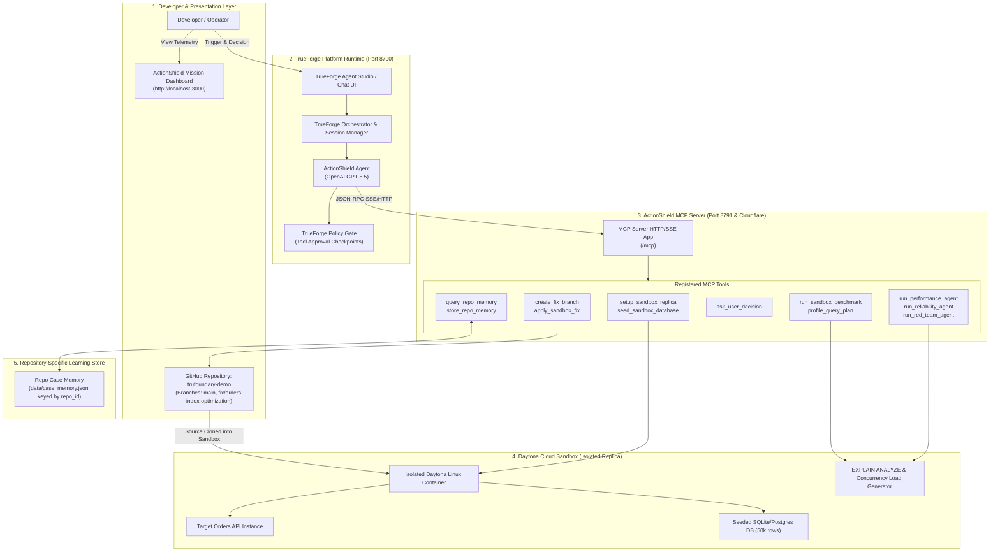

# 🛡️ ActionShield — System Architecture & Flow Diagrams

This document contains the complete, updated system architecture, end-to-end execution flow, and sequence diagrams reflecting developer-safe GitOps workflow.

### 💡 Core Mission & GitOps Philosophy
- **Zero Blind Production Mutation**: ActionShield **never** forces direct changes to `main` or touches production databases directly.
- **Deep Sandbox Testing**: Commits are tested inside an isolated Daytona Sandbox replica seeded with 50,000 realistic records.
- **Detailed Issue Summary**: Presents exact metrics, affected files, query execution plans, and expected failure modes.
- **Safe Branching & Re-testing**: If the developer asks for a fix, the agent creates a **new dedicated Git branch** (e.g. `fix/orders-index-optimization`), applies the fix, and **re-tests inside the sandbox**.
- **Developer in Control**: ActionShield delivers a fully verified branch with evidence so the engineering team can review and merge to `main` manually.
- **Repo-Specific Learning**: ActionShield stores all findings and verified fixes in repository-specific Case Memory, getting smarter as the codebase evolves.

---

## 1. High-Level System Architecture



---

## 2. End-to-End Autonomous Flow: The GitOps 2-Phase Lifecycle

```mermaid
flowchart TD
    Start(["Developer Pushes Commit or Requests Pre-Flight Check"]) --> S1["1. Provision Isolated Daytona Sandbox"]
    
    subgraph SandboxPhase1["PHASE 1: Deep Sandbox Stress Testing & Diagnosis"]
        S1 --> Seed["Clone Repo & Seed Sandbox DB with 50,000 Realistic Orders"]
        Seed --> LaunchApp["Launch Application Service inside Sandbox"]
        LaunchApp --> MultiAgent["Multi-Agent Testing Layer Dispatched:<br>• Performance Agent: p50/p95 latency & EXPLAIN ANALYZE<br>• DB Reliability Agent: Index coverage & transaction safety<br>• Red Team Agent: Table lock hazards & concurrency contention"]
        
        MultiAgent --> MetricsCaptured["Diagnostic Findings Captured:<br>• p95 Latency: 2,340 ms (Fails &lt;700ms SLO)<br>• Query: Full table scan on orders(user_id, created_at)<br>• Affected File: app/routes/orders.py<br>• Risk: High lock contention under production traffic"]
    end

    MetricsCaptured --> S2["2. Present Issue Summary to Developer"]
    S2 --> SummaryReport["Detailed Summary Delivered via TrueForge:<br>• Issue Seen: 2,340ms latency bottleneck<br>• Root Cause: Missing composite index<br>• Expected Hazard: Table locks under load<br>• Affected Files: app/routes/orders.py, schema"]

    SummaryReport --> AskFix["ask_user_decision:<br>'Would you like me to create a fix branch (fix/orders-index-optimization)<br>and test the proposed fix in the sandbox?'"]

    AskFix --> UserDecision{"Developer Decision in TrueForge"}
    
    UserDecision -->|Inspect Only| ManualFix(["Developer Fixes Manually — Sandbox Cleaned Up"])
    
    UserDecision -->|Create Fix Branch & Test| S3["3. Branch Creation & Sandbox Verification"]

    subgraph SandboxPhase2["PHASE 2: Branch Creation & Re-Testing in Sandbox"]
        S3 --> GitBranch["Create New Git Branch: fix/orders-index-optimization"]
        GitBranch --> QueryMem["Query Repo Memory for Past Solutions"]
        QueryMem --> AdaptFix["Generate Candidate Non-Blocking Fix:<br>CREATE INDEX CONCURRENTLY IF NOT EXISTS idx_orders_user_created<br>+ Reversible Rollback Script"]
        
        AdaptFix --> ApplySand["Apply Fix in Sandbox Database"]
        ApplySand --> ReTest["Re-run Benchmark inside Sandbox:<br>• Latency drops from 2,340ms ➔ 0.054ms (-99.8%)<br>• Red Team confirms zero table locks<br>• Reliability Agent confirms rollback works"]
    end

    ReTest --> S4["4. Push Fix Branch & Evidence Report"]
    S4 --> PushGit["Commit & Push fix/orders-index-optimization to GitHub<br>(Production main is NOT touched)"]
    
    PushGit --> S5["5. Store Repository-Specific Memory"]
    S5 --> Learn["Persist Trajectory to Repo Memory:<br>• repo_id: trufoundary-demo<br>• Symptoms & Query Signature<br>• Validated Migration Fix & Metrics"]
    
    Learn --> Ready(["Branch Ready for Developer to Review & Merge Manually!"])
```



---

## 3. Sequence Diagram with Exact Tool Interactions

```mermaid
sequenceDiagram
    autonumber
    actor Dev as Developer / Operator
    participant TF as TrueForge Studio (8790)
    participant Agent as ActionShield Agent (GPT-5.5)
    participant MCP as ActionShield MCP Server (8791)
    participant Sandbox as Daytona Sandbox (Isolated)
    participant GitHub as GitHub Repo (trufoundary-demo)

    Note over Dev,GitHub: Phase 1: Deep Sandbox Testing & Diagnostic Summary
    Dev->>TF: "Run pre-flight check on https://github.com/rajnishkumar13500/trufoundary-demo.git"
    TF->>Agent: Turn 1: Initiate Deep Pre-Flight Verification

    Agent->>MCP: call: setup_sandbox_replica(repo_url="...", commit="HEAD")
    MCP->>Sandbox: Provision container & clone repo
    Sandbox-->>MCP: { sandbox_id: "sbx_001", status: "READY" }
    MCP-->>Agent: Sandbox initialized

    Agent->>MCP: call: seed_sandbox_database(sandbox_id="sbx_001", rows=50000)
    MCP->>Sandbox: Insert 50k orders + items into sandbox DB
    Sandbox-->>MCP: { seeded_rows: 50000 }
    MCP-->>Agent: Database seeded

    Agent->>MCP: call: run_sandbox_benchmark(sandbox_id="sbx_001", concurrency=5)
    MCP->>Sandbox: Execute load against orders query
    Sandbox-->>MCP: { p50_ms: 780.0, p95_ms: 2340.0, scan_type: "SEQUENTIAL_SCAN" }
    MCP-->>Agent: Benchmark metrics returned

    Agent->>MCP: call: run_red_team_agent(sandbox_id="sbx_001")
    MCP->>Sandbox: Inspect schema locks and unindexed query contention
    Sandbox-->>MCP: { risk: "HIGH", failure_mode: "Table locks under concurrent writes" }
    MCP-->>Agent: Reviewer findings returned

    Note over Agent,TF: Issue Summary & Developer Decision
    Agent->>TF: Deliver Diagnostic Summary:<br>• Issue Seen: 2,340ms latency (Sequential Scan)<br>• Expected Issue: DB lock contention under concurrency<br>• Affected File: app/routes/orders.py<br>• Prompt: "Create fix branch fix/orders-index-optimization and test in sandbox?"
    TF-->>Dev: Displays Diagnostic Report & Choice

    Note over Dev,GitHub: Phase 2: Create Fix Branch & Re-Test in Sandbox (No Direct Merge to Main!)
    Dev->>TF: Reply: "Yes, please create the branch and test the fix in the sandbox."
    TF->>Agent: Turn 2: Authorization to create branch and test

    Agent->>MCP: call: create_fix_branch(repo_url="...", branch_name="fix/orders-index-optimization")
    MCP->>GitHub: Create and checkout branch fix/orders-index-optimization
    GitHub-->>MCP: { branch_created: "fix/orders-index-optimization" }
    MCP-->>Agent: Branch ready

    Agent->>MCP: call: apply_sandbox_fix(sandbox_id="sbx_001", sql="CREATE INDEX CONCURRENTLY IF NOT EXISTS idx_orders_user_created ON orders(user_id, created_at DESC);")
    MCP->>Sandbox: Apply non-blocking migration in sandbox
    Sandbox-->>MCP: { applied: true }
    MCP-->>Agent: Fix applied in sandbox

    Agent->>MCP: call: run_sandbox_benchmark(sandbox_id="sbx_001")
    MCP->>Sandbox: Re-run benchmark workload on sandbox
    Sandbox-->>MCP: { p95_ms: 0.054, improvement_pct: 99.8, scan_type: "INDEX_SCAN" }
    MCP-->>Agent: Re-test verified: 0.054ms!

    Agent->>MCP: call: push_branch_commit(branch_name="fix/orders-index-optimization", message="fix(db): add non-blocking composite index idx_orders_user_created")
    MCP->>GitHub: Push branch to origin/fix/orders-index-optimization
    GitHub-->>MCP: { pushed: true, commit_sha: "a7d9e1" }
    MCP-->>Agent: Branch pushed to GitHub

    Note over Agent,MCP: Phase 3: Repository-Specific Learning
    Agent->>MCP: call: store_repo_memory(repo_id="trufoundary-demo", issue="orders_latency", fix="CONCURRENT_INDEX", before_p95=2340.0, after_p95=0.054)
    MCP-->>Agent: { memory_stored: true, repo_id: "trufoundary-demo" }

    Agent-->>TF: "Fix verified in sandbox (2,340ms ➔ 0.054ms). Pushed to branch 'fix/orders-index-optimization'. Ready for your review and manual merge!"
    TF-->>Dev: Final report with GitHub branch link and sandbox evidence displayed
```

---

## 4. MCP Tool Mapping Table

| Tool Name | Stage | Description |
| :--- | :--- | :--- |
| `setup_sandbox_replica` | **Phase 1: Setup** | Clones candidate commit into an isolated Daytona Sandbox container. |
| `seed_sandbox_database` | **Phase 1: Seeding** | Seeds sandbox database with 50,000 realistic orders to replicate real-world load. |
| `run_sandbox_benchmark` | **Phase 1: Diagnosis** | Runs concurrent requests inside the sandbox to measure p50/p95 latency and query plan. |
| `run_red_team_agent` | **Phase 1: Risk Analysis** | Tests for table lock contention (`ACCESS EXCLUSIVE`) and concurrent write hazards. |
| `create_fix_branch` | **Phase 2: Branching** | Creates a dedicated Git branch (`fix/orders-index-optimization`) on GitHub. |
| `apply_sandbox_fix` | **Phase 2: Remediation** | Applies non-blocking candidate SQL (`CREATE INDEX CONCURRENTLY`) in sandbox DB. |
| `push_branch_commit` | **Phase 2: Git Push** | Pushes the verified branch to GitHub for the developer to review and merge manually. |
| `query_repo_memory` | **Learning** | Retrieves historical issues and solutions specific to this repository. |
| `store_repo_memory` | **Learning** | Persists verified findings, symptom signatures, and code fixes under the repository ID. |
